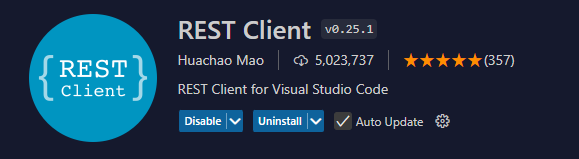
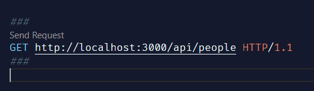

# ROI API - Node Version - 2024

## Installation Command

You can re-install all of packages with the following command:

```bash
npm install
```

## Seed Data

Run the seed script if you did not before

```bash
node seed.js
```

## Running the API

After installing the dependencies, you can run the API with:

```bash
npm start
```

## Install Extension



## Call the API

- Create an http file named `roiapi.http`
- Add http methods
- Separate methods with `###`
- Use the `Send Request` button located on top of each method to run it

